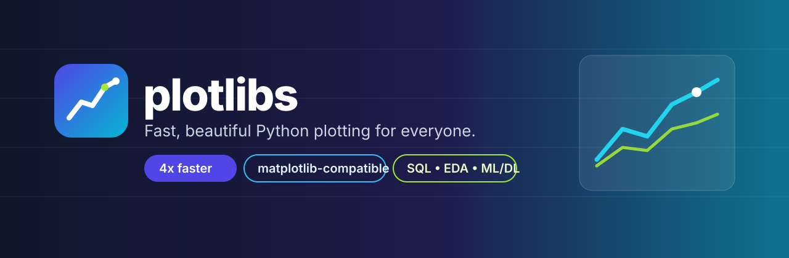

<p align="center">
  
</p>

<p align="center">
  
</p>

<h1 align="center">plotlibs</h1>
<p align="center"><b>Fast, beautiful Python plotting for everyone.</b></p>

<p align="center">
  <a href="https://github.com/salim-studio/plotlibs"></a>
  
  
  
  
  
</p>

> **Renamed:** `plotlib` → **`plotlibs`**.
> Old code keeps working via a shim (`import plotlib`), but please migrate to `import plotlibs`.
> New home: **https://github.com/salim-studio/plotlibs**

```python
import plotlibs as pl

pl.plot([1, 2, 3], [1, 4, 9], label="x²")
pl.xlabel("x"); pl.ylabel("y"); pl.legend()
pl.savefig("out.png")  # or pl.show()
```

## Why plotlibs?

| Audience | One-liner value |
|---|---|
| Developers | Matplotlib-compatible API, only `numpy + pillow`, ~4x faster on big data |
| Data analysts | `pl.load_csv` → `pl.quick_eda(df)` → `boxplot / kde / heatmap / countplot` |
| Databases | `pl.db_connect("sales.db")` + `pl.read_sql(...)` + `plot_from_sql(...)` (sqlite / SQLAlchemy / DuckDB) |
| Machine learning | `plot_confusion_matrix`, `plot_roc`, `plot_pr`, `feature_importance`, `residuals`, `elbow` |
| Deep learning | `plot_history`, `plot_images`, `plot_clusters_2d` |

## Install

```bash
pip install plotlibs                    # minimal: numpy + pillow
pip install "plotlibs[all]"             # pandas + sqlalchemy + duckdb + sklearn + matplotlib
pip install -e ".[dev]"                 # contributors
```

## 30-second tour

```python
import plotlibs as pl

# 1) EDA in one line
df = pl.load_csv("sales.csv")
print(pl.describe(df))
pl.quick_eda(df)

# 2) Stats plots (all matplotlib-style signatures)
pl.boxplot([[1, 2, 3], [2, 3, 4]], labels=["A", "B"])
pl.violinplot([[1, 2, 3], [2, 3, 4]])
pl.kde(df["sales"])
pl.heatmap([[1, 0.8], [0.8, 1]], annot=True)
pl.corr(df, annot=True)
pl.countplot(["Cairo", "Oran", "Cairo"])
pl.area([1, 2, 3], [1, 1, 1], [2, 2, 2], labels=["a", "b"])
pl.hist2d([1, 2, 2, 3], [1, 1, 2, 2])
pl.stem([1, 2, 3], [2, 1, 3])
```

```python
# 3) SQL -> plot
conn = pl.db_connect("sales.db")   # or ":memory:", "sqlite:///x.db", "duckdb://shop.ddb"
pl.to_sql(df, "sales", conn)
print(pl.db.list_tables(conn))
df2 = pl.read_sql("SELECT region, SUM(amount) FROM sales GROUP BY region", conn)
pl.db.plot_from_sql("SELECT qty, amount FROM sales LIMIT 500", conn, kind="scatter")
```

```python
# 4) ML / DL
pl.plot_history({"loss": [0.9, 0.5, 0.3], "val_loss": [1.0, 0.6, 0.4]})
pl.plot_confusion_matrix(y_true, y_pred, normalize=True)
pl.plot_roc(y_true, y_score, label="xgb")
pl.plot_feature_importance(["age", "salary", "city"], [0.5, 0.3, 0.2])
pl.plot_images(mnist_images)
```

## Visual identity

Brand: **midnight ink `#0F172A` + indigo `#4F46E5` + cyan `#06B6D4`**, highlights lime `#A3E635` / amber `#FACC15`, background paper `#F8FAFC`. Logo: rounded-square gradient with a white line chart. See [`assets/`](assets/) and [`BRANDING.md`](BRANDING.md).

Signature theme:

```python
import plotlibs as pl
pl.style.use("plotlibs")        # light signature
pl.style.use("plotlibs-dark")   # dark signature
print(pl.style.available())
```

| Token | Hex | Use |
|---|---|---|
| primary | `#4F46E5` | lines, logo start, links |
| accent | `#06B6D4` | second series, banner end |
| ink | `#0F172A` | text, dark backgrounds |
| paper | `#F8FAFC` | page background |
| lime | `#A3E635` | highlight dots |
| amber | `#FACC15` | highlight dots |

## Matplotlib compatibility

| matplotlib | plotlibs 0.3.0 |
|---|---|
| `plot / scatter / bar / hist / imshow / pie / fill_between / step / errorbar` | ✅ same signature |
| `boxplot / violinplot / hist2d / stem / stackplot` | ✅ |
| `xlabel / ylabel / title / legend / grid / xlim / ylim / savefig / show / subplots` | ✅ |
| `style.use / rcParams` | ✅ + `plotlibs`, `plotlibs-dark`, `seaborn`, `plotly`, `publication` |

## Why faster?

1. **Min-max decimation** — lines over 2000 points are bucketed (min+max preserved), `O(n)` in numpy.
2. **Pillow rasterizer** — direct C-level drawing, no heavy layout engine.
3. **Vectorized pipeline** — data→pixel in one pass, numpy ticks/limits.
4. **No heavy objects** — artists are plain dicts, render is deferred.

Benchmark (`n=200k`, `benchmarks/bench.py`):

```
plotlibs   : ~370 ms/plot
matplotlib : ~1560 ms/plot
speedup    : ~4.2x faster
```

## Project layout

```
plotlibs/              # repo root (package name == repo name)
  plotlibs/            # real package
    __init__.py  pyplot.py  figure.py  colors.py  fast.py  style.py
    data.py  db.py  eda.py  ml.py
    backends/renderer.py
  plotlib/             # deprecated shim (renamed alias)
  assets/              # logo.svg, banner.svg
  tests/  benchmarks/  examples/
```

## Migration from `plotlib`

```diff
- import plotlib as pl
+ import plotlibs as pl
```

`import plotlib` still works in 0.3.x (emits `DeprecationWarning`) and will be removed in 1.0.

## Roadmap

- [x] 0.3.0 — Rename to **plotlibs**, English docs, brand identity (this release)
- [ ] 0.4.0 — Interactive HTML export (`pl.save_html`), dashboards, RTL/Arabic labels
- [ ] 0.5.0 — Geo + time-series + sklearn/HF pipeline helpers
- Suggest ideas: open an issue with `[idea]` at https://github.com/salim-studio/plotlibs/issues

## Contributing

```bash
python -m pytest tests -q
python examples/demo.py
python examples/demo_fame.py
```

## License

MIT — see [LICENSE](LICENSE).
